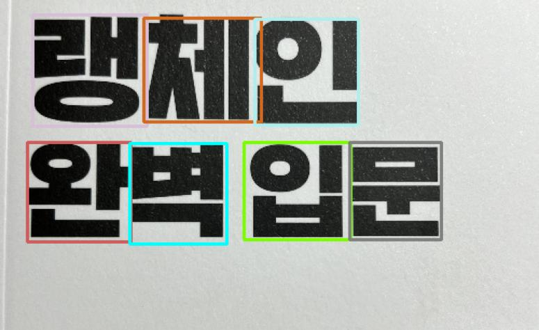

# Character_detection_CRAFT
NAVER Clova AI tream. [CRAFT git](https://github.com/clovaai/CRAFT-pytorch?tab=readme-ov-file)(Character-Region Awareness For Text detection)를 기반으로 개별 문자영역 탐지 테스트

# Overview



# Info.
* CRAFT에선 IP(Intellectual Property)문제로 train 코드를 제공하지 않으므로 pretrained model만 쓸 수 있음
* 그럼에도 왠만한 문자는 잘 인식하는 듯한데, 이것으로도 해결이 안된다면 다른 project를 찾아야 할 것임
* 영어, 숫자뿐 아니라 한글도 어느정도 잘되지만 완벽하진 않은 듯함

## Getting started
## Download pretrained model 
* CRAFT에서 공개한 pretrained model 다운로드 필요 : [Click](https://drive.google.com/open?id=1Jk4eGD7crsqCCg9C9VjCLkMN3ze8kutZ)
* repository내 폴더 생성 후 저장 (`weights/craft_mlt_25k.pth`)

## Modify config
* `configs/config.yaml`을 보고 적절히 변경

## Run
```bash
python infer_chat_bndbox.py -c configs/config_240603.yaml
```
